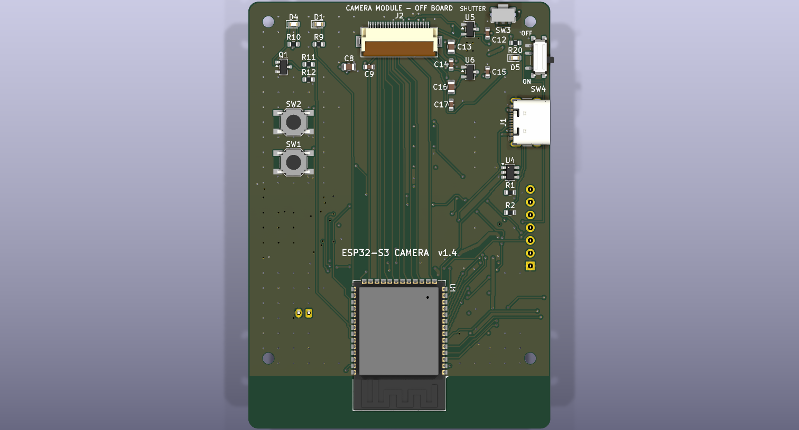
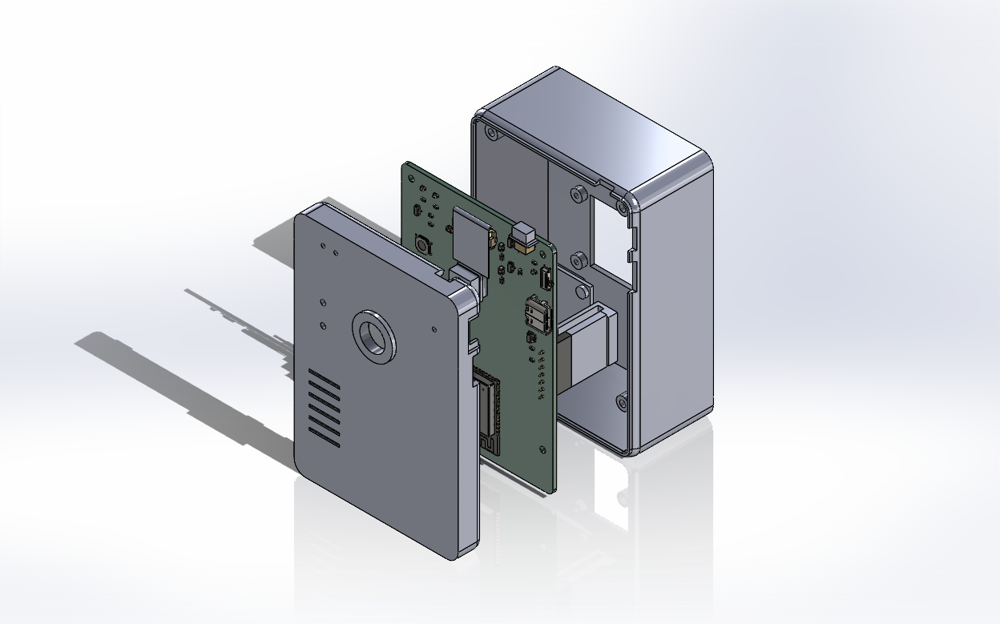

# ESP32-S3 Camera — v1.4

以 ESP32-S3-WROOM-1-N16R8 為核心的隨身相機板：OV2640 DVP 相機、microSD 存檔、USB-C 燒錄與充電、鋰電池供電、電源開關與電源燈，1.3 吋 ST7789 預覽螢幕直接插在背面的母座上，快門在上板邊側按。v1.3 起為 3D 列印相機式外殼（鏡頭正面、螢幕背面）而改，v1.4 把快門移到上板邊。KiCad 10 專案，設計成直接送 JLCPCB PCBA。



| 項目 | 規格 |
|---|---|
| 板子 | 60 × 85 mm、4 層（In1 = GND、In2 = +3V3）、1.6 mm、四角 M2 孔 |
| 主控 | U1 ESP32-S3-WROOM-1-N16R8（16 MB flash、8 MB OPI PSRAM） |
| 相機 | J2 24P 0.5 mm FPC 座，AI-Thinker ESP32-CAM 標準腳位；U5 2.8V、U6 1.2V LDO 供相機 |
| 儲存 | J3 microSD（SDMMC），開口朝左板邊 |
| 電源 | J1 USB-C → U3 TP4056 充電 → J4 JST PH 2.0 鋰電池；U2 AP2112K 3.3V LDO；SW4 滑動開關控制 LDO EN；D5 藍色電源燈 |
| 操作 | SW3 SHUTTER 側按式（ALPS SKRTLAE010）在上板邊右段 (50.6, 2.6)；SW1 BOOT、SW2 RESET 頂面按壓式在左欄；D1 綠、D2 紅（充電）、D4 白 LED |
| 螢幕 | J5 1×7 2.54 mm 母座（底面右板邊），通用型 1.3 吋 IPS 240×240 ST7789 7 pin 模組，用七條公–母杜邦線接（2026-09-23 起；也可直插）；SCL=GPIO44、SDA=GPIO43、RES=GPIO6、DC=GPIO5、BLK=GPIO4。UART0 排針已取消 |
| 零件 | 60 顆：58 SMD 由 JLCPCB 貼片，2 插件（J4 電池座、J5 螢幕母座） |
| 狀態 | v1.4，2026-09-22 定稿。ERC 0、DRC 0/0/0、原理圖一致性 0、GND/3V3 連通性 0 孤立焊盤 |

## 目前狀態

- **v1.4 已定稿，可下單。** 快照在 `versions/v1.4/`，含 Gerber、BOM、CPL、ERC/DRC 報告，視為唯讀。v1.2、v1.3 都沒有下單。
- **預覽螢幕用七條公–母杜邦線接板上母座 J5**（2026-09-23 決定，省事不焊；腳序一對一）。模組鎖在後殼四支矮柱上、蓋在電池上方，亮面離板底約 26.4 mm；外殼後半因為杜邦膠殼加深到 27 mm 內深，整機 40.1 mm。細節與外殼用的尺寸在 `DESIGN.md` 2d 節與 `enclosure/README.md`。
- 版本沿革：v1.0 最初佈局 → v1.1 相機腳位改 ESP32-CAM 標準、加相機 LDO、填 LCSC 料號 → v1.2 加 SW4、R21、R20、D5 與 ON/OFF 絲印 → v1.3 J5/J6 兩條排針換成 1×7 螢幕母座 J5（SMD 與 CPL 不變）→ v1.4 快門 SW3 換成側按式移到上板邊右段，C12 下移 0.8 mm（CPL 只差這兩行）。
- 外殼相關但仍刻意沒改：LED 分兩面、板邊開口分三邊（USB-C 與開關右邊、記憶卡左邊、快門上邊）。
- 送洗前檢查補了兩顆 GND 過孔（J2.23、C3.2 原本焊盤浮接），細節見 `DESIGN.md` 第 3 節。

## 簡報

| 檔案 | 給誰看 | 內容 |
|---|---|---|
| `esp32s3-camera-v1.4-簡易版.pptx` / `.pdf` | 外行人、家人朋友、沒碰過電路板的人 | 11 頁，不用零件編號與專業縮寫：它能做什麼、正反面長什麼樣、工廠做哪些我們做哪些、要買什麼、三步組裝、三件注意事項、外殼長這樣、裝進殼裡長這樣 |
| `esp32s3-camera-v1.4.pptx` / `.pdf` | 自己下單與組裝時對照、有電子背景的人 | 20 頁完整版：依 PCB 座標畫的零件分工圖、Economic / Standard 差異、58 顆 SMD 清單、3D 渲染、組裝尺寸與高度、三頁 3D 列印外殼（含板外零件裝配檢查）、含購買連結的採購表 |

另有一個線上頁面「ESP32-S3 相機板零件分工圖」（claude.ai 私人連結，組織內可看），2026-09-23 已更新到 v1.4 杜邦線版：依座標畫的零件分工圖、組裝示意與裸板 3D 渲染、外殼與杜邦線走線渲染、採購清單。

兩份都用 PowerPoint 匯出成 PDF，PDF 內的購買連結可點。兩份簡報 2026-09-23 已更新到 v1.4（螢幕母座、側按快門、外殼）；更新方式是 `tools/update_decks_v14.py` 在 v1.2 檔上改文字、換圖、加頁，再用 `tools/export_decks.py` 叫 PowerPoint 匯出 PDF 與檢查用的 PNG。

## 檔案地圖

```
esp32s3-camera/
├── README.md                     本檔
├── DESIGN.md                     設計規格書：決策、腳位、電路細節、組裝與機構、版本規則
├── esp32s3-camera.kicad_pro/.kicad_sch/.kicad_pcb   KiCad 10 專案（根目錄永遠是最新版）
├── esp32s3-camera.pretty/        自訂 footprint（ESP32-S3-WROOM-1-Cam）
├── esp32s3-camera.step           板子 STEP，給外殼設計用
├── erc.rpt / drc.rpt / netlist.net
├── view-top.png / view-bottom.png   v1.4 頂面、底面 3D 正視
├── esp32s3-camera-v1.4.pptx / .pdf   零件分工、組裝示意、渲染圖、外殼、採購清單簡報（完整版 20 頁）
├── esp32s3-camera-v1.4-簡易版.pptx / .pdf   給外行人看的 11 頁簡易版
├── tools/                        簡報更新與匯出腳本（python-pptx + PowerPoint COM）
│
├── fab/                          送廠檔案
│   ├── esp32s3-camera-gerber.zip   Gerber + 鑽孔打包
│   ├── esp32s3-camera-bom.csv      BOM，含 LCSC Part # 欄
│   ├── esp32s3-camera-cpl.csv      貼片座標
│   ├── gerber/                     未打包的 Gerber、鑽孔檔
│   ├── JLCPCB-上傳-v1.4/            上傳用三個檔案的重新命名版 + 一頁說明
│   ├── JLCPCB-下單清單.md           下單逐步核對表，含收到板子後的第一次上電
│   └── 採購清單.md                  板外零件與插件的購買網址
│
├── render/                       kicad-cli 光線追蹤渲染
│   ├── iso-*/top/bottom/low-angle/closeup-*.png   裸板貼片後
│   ├── assembled-*.png / closeup-camera-module.png   插相機、記憶卡、電池、螢幕的組裝示意
│   └── illustration/             示意渲染專用的板檔複本、簡化 VRML 模型、輔助腳本（見下）
│
├── versions/                     各版完整快照，唯讀
│   ├── v1.0/  v1.1/  v1.2/  v1.3/  v1.4/   每版有 README.txt 說明改了什麼
│
├── enclosure/                    3D 列印外殼：SolidWorks 前殼、後殼、按鈕帽、組合件、STL、渲染圖與產生腳本（見 enclosure/README.md）
├── frames/                       2026-09-11 早期佈局的旋轉截圖，僅供回顧
└── .history/                     KiCad 自動快照，由 KiCad 管理
```

`render/illustration/esp32s3-camera-illustration.kicad_pcb` 多了三個沒有焊盤的假零件掛簡化模型，**只用來渲染，不要拿它出 Gerber**。

## 怎麼下單

1. 依 `fab/JLCPCB-下單清單.md` 逐項核對。上傳 `fab/esp32s3-camera-gerber.zip`、`esp32s3-camera-bom.csv`、`esp32s3-camera-cpl.csv`。
2. PCB：4 層、60 × 85 mm、1.6 mm、1 oz、ENIG 建議、Tented via，最少 5 片。
3. PCBA：雙面貼片，最少 2 片。
   - **Economic** 只焊 SMD：J4 電池座、J5 1×7 母座（C225482）自己買回來手焊。
   - **Standard** 含插件：兩顆一起焊好。
4. 料號配對頁逐行看：U1 `C2913202`（N16R8，可能預購，不要被換成 N8 或無 R 版）、D3 `C8598`（SOD-123，不是 SS14）、SW4 `C431540`、SW3 `C110293`（ALPS SKRTLAE010 側按，不要被換成頂按式）。
5. 零件擺放預覽確認方向：U1 天線端朝板子底邊、J1 開口朝板邊、J2 掀蓋朝板邊、SW4 撥桿朝右板邊、**SW3 觸桿朝上板邊**、J5 母座在底面、方形 pin 1 焊盤朝天線那一端。

## 板外要自己買的

相機模組、鋰電池、microSD 卡、USB-C 線是最小採購；Economic 方案再加 J4 電池座。完整清單與購買網址在 `fab/採購清單.md`。

| 品項 | 規格 | 接到 |
|---|---|---|
| OV2640 相機模組 | 24 pin 0.5 mm 排線，ESP32-CAM 相容，排線約 21 mm，多買一條備用 | J2 |
| 3.7V 鋰電池 | 603040 或 503040 約 600 mAh，帶保護板，JST PH 2.0 插頭 | J4 |
| microSD 卡 | 8–32 GB | J3 |
| USB-C 線 | 要能傳資料 | J1 |
| 預覽螢幕 | 通用型 1.3 吋 IPS 240×240 ST7789，7 pin 2.54 mm 直排針已焊，27.78 × 39.22 mm | 七條公–母杜邦線接 J5 |
| 杜邦線 | 公–母、10 cm、7 條 | 公頭插 J5、母頭套螢幕排針 |
| M2 螺絲與銅柱 | 板子 4 組 | H1–H4 |
| 雙面泡棉膠 | 約 2 mm 厚 | 相機模組與電池底下 |

## 組裝重點

- **相機**：排線接觸面朝下插入 J2，出來約 2.5 mm 就反折 180° 蓋回 J2，模組貼在按鍵欄與 U4 之間的空區（x 25.5–34.5、y 20.5–29.5 mm），鏡頭中心 (30, 25)，底下墊 8 × 8 mm 泡棉膠。
- **電池**：貼在底面中央 (34, 44)，墊 2 mm 泡棉，保護板端朝下緣。**J4 pin 1 = 正極**，在 L 形絲印那一側、靠板子中央。電池插頭極性沒有統一規範，插之前先量。
- **螢幕**：模組排針對準底面右板邊的 J5 母座直接插到底，亮面朝外、身體蓋在電池上方。腳序一對一：GND、3V3、SCL (GPIO44)、SDA (GPIO43)、RES (GPIO6)、DC (GPIO5)、BLK (GPIO4)，板上每格都有絲印，**第一次插之前先對一下模組上的 GND 字有沒有對到板上 GND 那格**。借用 UART0 腳位當 SPI，USB 序列埠仍可用。
- **快門**：SW3 在上板邊右段，觸桿朝板邊伸出 0.56 mm 內，由外殼上牆的快門帽按壓；不裝外殼時用指甲從板邊按。BOOT、RESET 仍在鏡頭面左欄。
- **電源開關**：撥向板子上緣（角落孔那側）= OFF，撥向模組 = ON，絲印已標。關機時 USB 仍可充電，D2 紅燈照常。D5 藍燈接 3.3V，開機必亮。
- **microSD**：從左板邊插入 J3，金手指朝電路板，推到「喀」一聲。
- **底面高度**：電池 + 泡棉 8 mm；J5 上的杜邦公頭膠殼到板底下 22.5 mm；螢幕模組背面離板底 23.6 mm、亮面 26.4 mm，外殼底側內深 27.0 mm。
- **外殼開孔**：鏡頭 (30, 25) 頂面；快門上板邊 x 47.6–53.6、板頂以上 0.2–4.4 mm；BOOT/RESET 針孔 (9, 24)、(9, 32)；開關右板邊 y 8–14；USB-C 右板邊 y 19.5–28.5；記憶卡左板邊 y 36–52；螢幕窗 23.4 × 23.4 mm，中心約 (28.4, 45) 底面。板子 STEP 在 `esp32s3-camera.step`，含母座；螢幕模組的簡化模型在 `render/illustration/models/display_module.wrl`。

## 外殼

`enclosure/` 是給 v1.4 板子的相機式兩片殼（前殼鏡頭面、後殼螢幕面，快門帽在上牆），用 `enclosure/build_enclosure_sw.py` 透過 SolidWorks 2024 的 API 依板檔座標自動建模，組合件含板子 STEP 與板外零件簡化模型，干涉檢查 0 件。螢幕模組用四支 M2×4 鎖在後殼的矮柱上、以七條杜邦線接 J5，快門帽在上牆。外形 65 × 90 × 40.1 mm，四支 M2×35 從背面鎖。組合件連相機模組、排線反折、電池與電池線、記憶卡、螢幕模組、杜邦線的簡化模型都放進去做過干涉檢查，0 件。尺寸依據、列印方向、組裝步驗與第一次實體要驗證的項目都在 `enclosure/README.md`。



## 收到板子後的第一次上電

先不插相機與電池。接 USB-C 撥 SW4 看 D5 亮滅，量 +3V3 / +2V8 / +1V2 對地無短路且電壓正確，電腦看到 ESP32-S3 USB 裝置，燒 blink 測 D1。都過了再依序插 microSD、相機排線、最後接電池。完整清單在 `fab/JLCPCB-下單清單.md` 第 8 節。

## 韌體

Arduino IDE `esp32` 套件的 CameraWebServer 範例，或 ESP-IDF 的 `esp32-camera` component。Board 選 **ESP32S3 Dev Module**，PSRAM 選 **OPI PSRAM**（R8 是 octal，選 QSPI 會抓不到）。相機 GPIO 對應表在 `DESIGN.md` 第 4 節，直接填進 `camera_config_t`。

## 版本規則

- 根目錄永遠是正在改的最新版。每次出 Gerber 準備下單，把 `.kicad_pcb / .kicad_sch / .kicad_pro`、`esp32s3-camera.pretty/`、`fp-lib-table` 與 `fab/` 內的 zip、BOM、CPL 複製到 `versions/vX.Y/`，並寫 README.txt。
- 版本號用數字（v1.0、v1.1、v1.2），不用 rev A / rev B。板上絲印、KiCad 標題欄、Gerber ProjectId 三處同步。
- 不在根目錄留 `*.bak_before_xxx`，中途快照交給 KiCad 的 `.history/`。
- 2026-09-21 起以 Git 管理，遠端為公開的 GitHub LCQIANN/esp32s3-camera；`versions/` 的快照仍照上面規則保留。

## 重新輸出送廠檔

```
kicad-cli sch export bom --fields "Reference,Value,Footprint,QUANTITY,LCSC" --labels "Designator,Comment,Footprint,Qty,LCSC Part #" --group-by "Value,Footprint,LCSC" --exclude-dnp -o fab/esp32s3-camera-bom.csv esp32s3-camera.kicad_sch
kicad-cli pcb drc --schematic-parity esp32s3-camera.kicad_pcb
```

## 輔助腳本（`render/illustration/`，用 KiCad 附的 python 執行）

| 腳本 | 用途 |
|---|---|
| `gnd_connectivity.py` | 幾何連通性檢查：焊盤、過孔、走線、敷銅做 union-find，確認每個 GND / +3V3 焊盤都在主群集。**DRC 只要有 unconnected_items 就跑一次，0 才算過。** |
| `battery_check.py` | 電池投影範圍對底面零件外框與高度的間距核對 |
| `fix_v12_gnd.py` | 2026-09-21 補 J2.23、C3.2 GND 過孔與 R21 腳位修正 |
| `v12_sch.py` / `v12_pcb.py` / `v12_silk_onoff.py` | v1.2 加 SW4、R20、R21、D5 與 ON/OFF 絲印的自動改板腳本 |
| `make_illustration_board.py` | 產生示意渲染用的板檔複本 |
| `gen_camera_wrl.py` / `gen_display_wrl.py` | 產生相機模組與螢幕的簡化 VRML 模型（KiCad 不畫 Cylinder 基本體，圓柱要用網格） |
| `sch_inspect.py` | 原理圖檢查工具 |

## 教訓

- DRC 報的「zone unconnected」不要當敷銅碎片忽略。KiCad 只回報兩群集間最近的一對物件，浮接的焊盤會藏在後面。
- D3 要用 B5819W SOD-123（`C8598`），LCSC 上的 SS14 是 SMA 封裝，焊盤不合。
- JLCPCB 的零件旋轉定義與 KiCad 不一定一致，零件擺放預覽頁逐一看有極性的零件。
