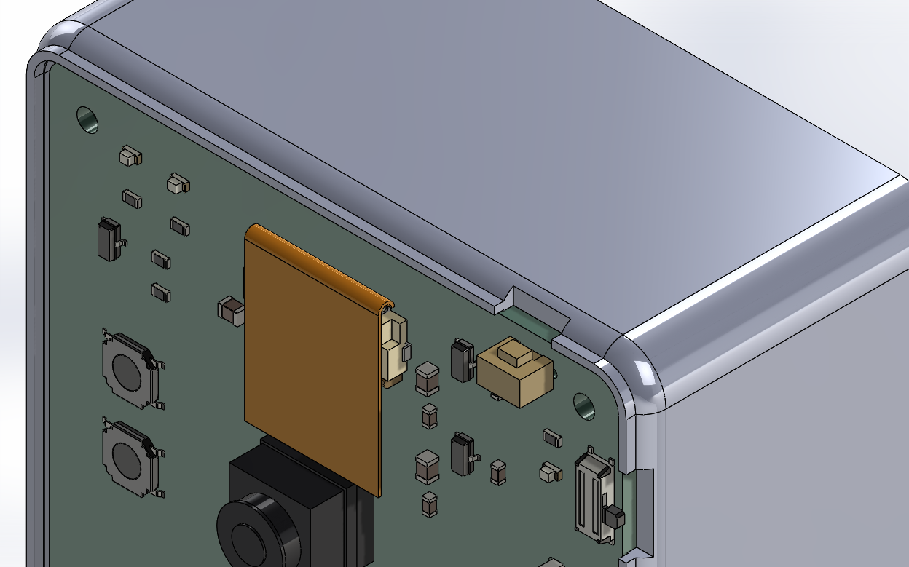
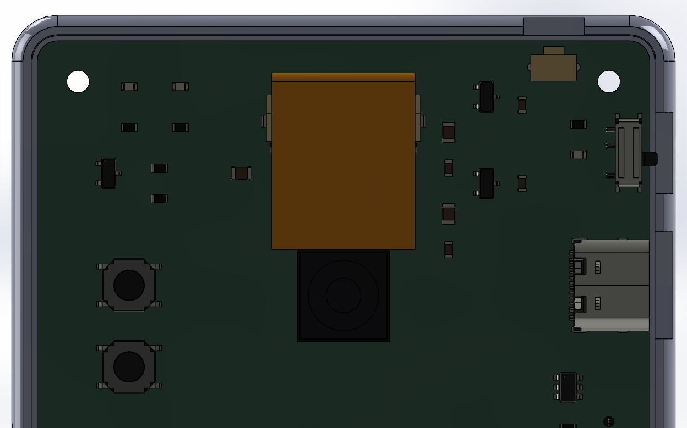
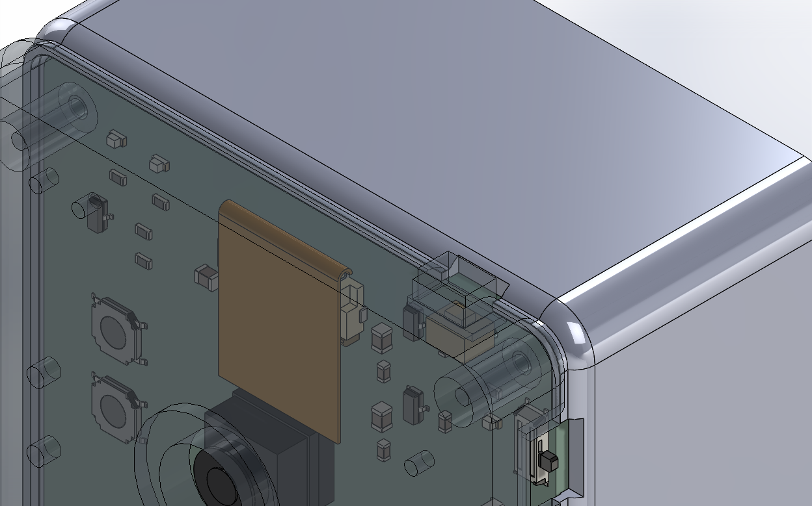
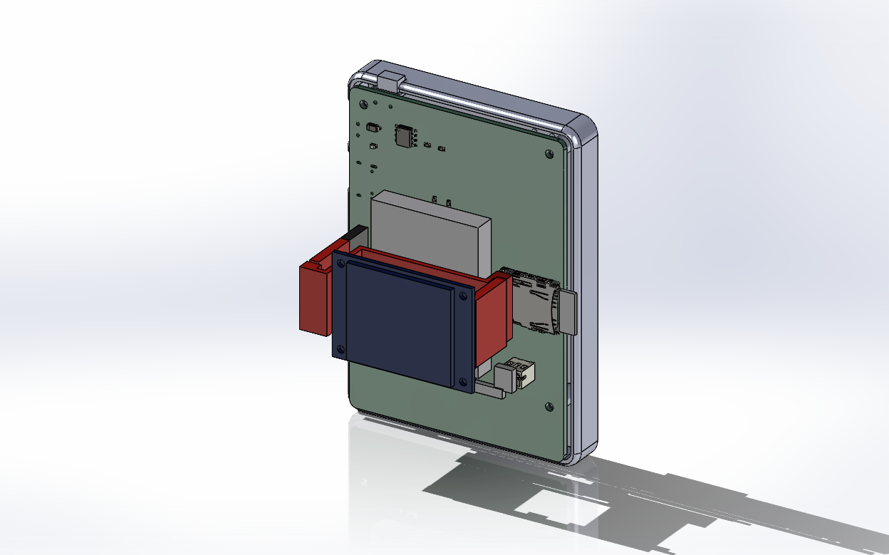
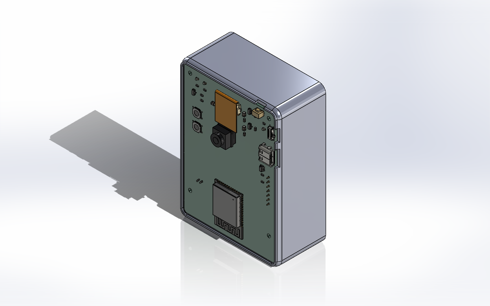
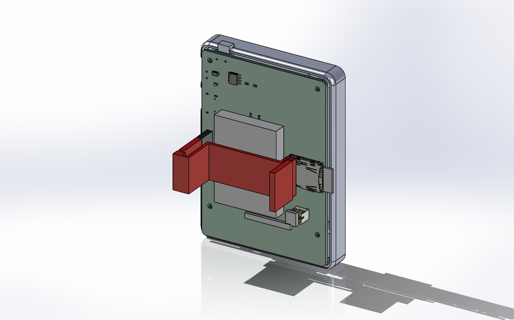
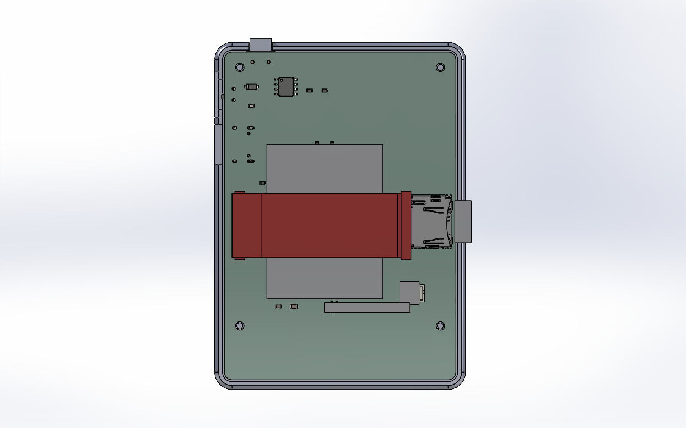
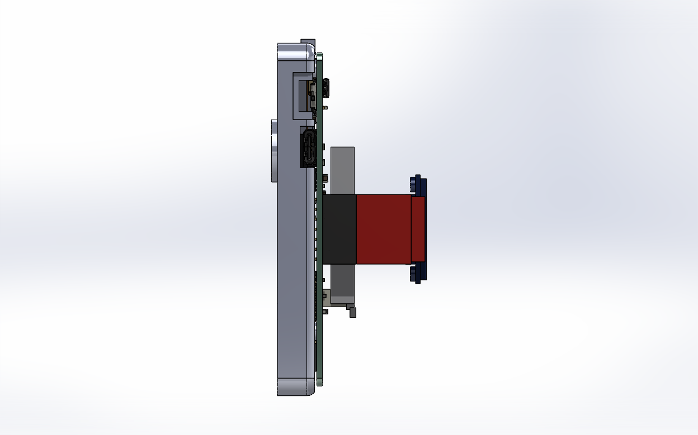
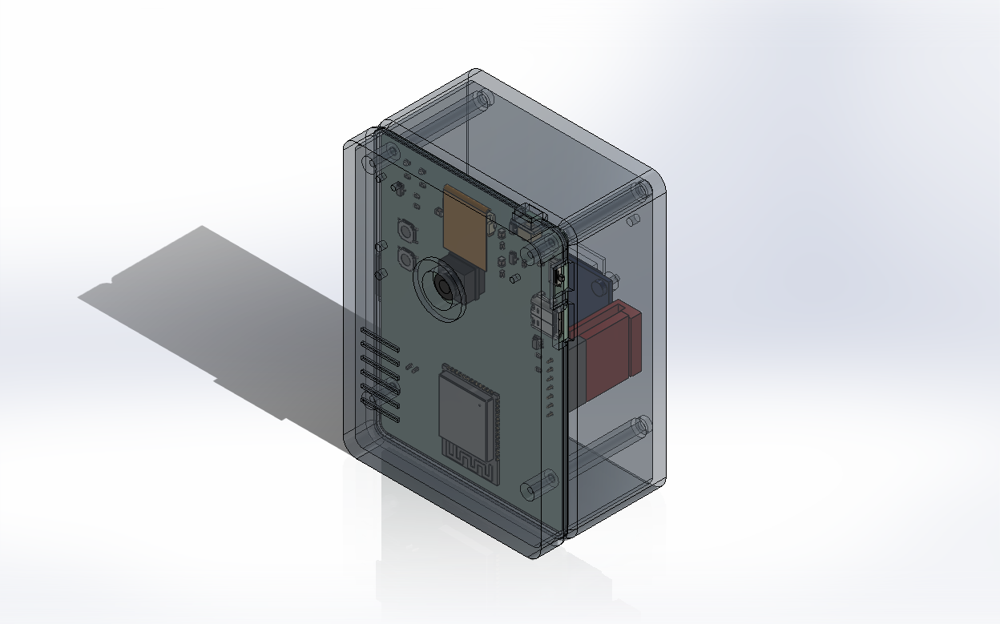
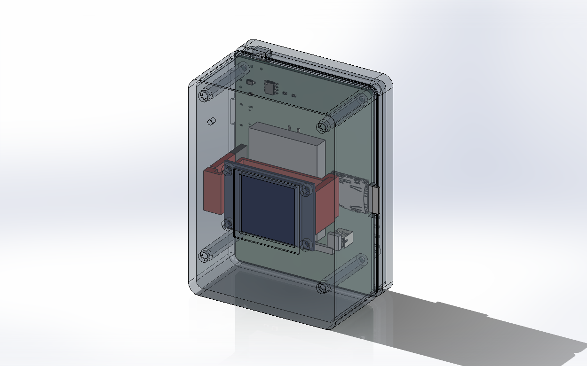

# ESP32-S3 Camera v1.4 — 3D 列印外殼（SolidWorks 2024）

相機式兩片殼：**前殼**（鏡頭與凸起鏡座環、上牆的快門帽、BOOT/RESET 針孔、三個 LED 導光孔、左側握持溝紋、USB-C 與電源開關的開口）＋**後殼**（內縮邊框的螢幕窗、記憶卡插槽、四支板子立柱、四支螢幕螺絲柱），外緣整圈 R2.5 倒圓、直角 R4.5，用四支 M2×35 螺絲從背面鎖穿。整組 **65 × 90 × 40.1 mm**（鏡座環再凸 1.5），壁厚 2 mm。
螢幕模組**用七條公–母杜邦線接 J5**（2026-09-23 決定，省事不焊）：公頭插板上母座、母頭套模組排針；後殼因此加深到 27 mm 內深，模組改用四支 M2×4 鎖在後殼柱子上。
所有零件都是 `build_enclosure_sw.py` 透過 SolidWorks COM API 依 v1.4 板檔的座標畫出來的，改尺寸就改腳本開頭的參數重跑。v1.3 版外殼（三顆正面按鈕帽）已被取代。

## 檔案

| 檔案 | 內容 |
|---|---|
| `esp32s3-camera-enclosure.SLDASM` | 組合件：板子 + 前殼 + 後殼 + 快門帽，全部固定在板子座標系，已跑干涉檢查 0 件 |
| `esp32s3-camera-shell-front.SLDPRT` / `.STL` | 前殼（鏡頭面） |
| `esp32s3-camera-shell-back.SLDPRT` / `.STL` | 後殼（螢幕面） |
| `esp32s3-camera-shutter-cap.SLDPRT` / `.STL` | 快門帽，印 1 個（T 形，凸緣在牆內） |
| `esp32s3-camera-board.SLDPRT` | 由 `../esp32s3-camera.step` 匯入的板子（148 個實體合成一個多實體零件），只給組合件用 |
| `enclosure-*.png` | 各方向渲染與爆炸圖 |
| `build_enclosure_sw.py` | 產生器。SolidWorks 開著時執行 `python enclosure/build_enclosure_sw.py`；只重建組合件加 `--asm-only` |

## 座標系

組合件用板子座標：X = KiCad x，Y = −KiCad y，Z = 0 在板子**頂面**（鏡頭那一面），板底 Z = −1.6。
前殼佔 Z 0 ～ +9，後殼佔 Z −31.1 ～ 0，分模線就在板子頂面。KiCad 的 STEP 是 Y 上下顛倒的右手座標，所以直接對得上，只平移 Z。

## 尺寸怎麼來的

| 項目 | 數字 | 依據 |
|---|---|---|
| 內腔 | 61 × 86 mm | 板子 60 × 85 + 每邊 0.5 mm 間隙 |
| 前殼內高 | 8 mm（板頂以上） | 相機模組：泡棉 2.3 + PCB 1 + 鏡座 3.5 = 鏡座頂 6.9，留 1.1 mm；鏡筒與壓環到 9.0 穿出 Ø10 孔，鏡片在鏡座環裡內縮 2.5 mm；USB-C 座 3.3、ESP32 模組 3.1 |
| 後殼內深 | 27.0 mm（板底以下） | 插在 J5 上的杜邦公頭：母座 8.5 + 膠殼 14.0 = 22.5，線從膠殼尾端彎出來再要 3.5，留 1.0；螢幕模組就吊在這個深度：背面離板底 23.6、玻璃面 26.4，離底板內面 0.6 給窗框泡棉；電池 6 + 泡棉 2 = 8 |
| 板厚 / 壁厚 / 底板 | 1.6 / 2.0 / 前 2.0、後 2.5 | 後底板 2.5 是為了放 1.5 mm 深的螺絲頭沉孔 |
| 直角圓角 | R4.5 外、R3.5 中、R2.5 內 | 三層同心；板子四角有 2 mm 斜切，Ø5 立柱仍在內腔圓弧內 |
| 面的倒圓 | 鏡頭面與螢幕面的外緣整圈 R2.5 | 板 2 mm 加牆 2 mm，45° 處最薄 1.8 mm |
| 鏡座環 | Ø16 / Ø10、凸出 1.5 mm | 鏡頭孔外一圈凸環，相機味，也擋住鏡頭孔邊緣的層紋 |
| 握持溝紋 | 鏡頭面左側 x 3.5–15.5，六道 1 mm 寬 0.6 mm 深，y 50–70 每 4 mm 一道 | 針孔下方的空區；內側是前殼柱子，不影響 |
| 螢幕邊框 | 螢幕窗外 28.5 × 28.5 內縮 0.8 mm | 讓窗看起來是一片面板，不是牆上開個洞 |
| 立柱（後殼） | Ø5 × 14.5，Ø2.4 穿孔，底面 Ø4.2 × 1.5 沉孔 | 在板子四角 M2 孔 (4,4)(56,4)(4,71)(56,71) |
| 柱（前殼） | Ø4.6 × 8，Ø1.6 × 7 導孔 | M2 自攻，M2×35 進去 5.4 mm；Ø4.6 是因為 (56,4) 那支離 SW4 只有 0.2 mm |
| 唇口 | 後殼內側 0.8 mm 厚、高 1 mm，前殼對應凹槽 1.0 mm，每側 0.1 mm 間隙 | 對位用，也擋光 |
| 鏡頭孔 | Ø10 @ (30, 25) | 相機模組鏡頭中心 |
| 快門窗 | 上牆（y = 0 那一側）x 47.6–53.6、板頂以上 Z 0.2–4.4；後殼唇口同位置開缺口 | SW3 ALPS SKRTLAE010 側按，觸桿頭在 y = 0.56、Z 1.75，開關高 3.5 |
| 快門帽 | 凸緣 7.6 × 4.0 × 0.8 在牆內，頭 5.6 × 3.6 穿牆、露出 1.0 mm，總長 4.06 | 觸桿頭到牆內面 1.06 mm：凸緣 0.8 + 預行程 0.26；開關行程 0.25 |
| BOOT / RESET 針孔 | Ø2.0 @ (9, 24) RESET、(9, 32) BOOT，穿過 2 mm 頂板 | 用 SIM 卡針或牙籤從 7 mm 外按 1.5 mm 高的開關 |
| LED 導光孔 | Ø1.5 @ (14,4.5) D1 綠、(9,4.5) D4 白、(53,11.2) D5 藍；後殼 Ø2 @ (53,14) D2 紅 | 頂面直接透光；D2 隔 14.5 mm，只看得到微光 |
| USB-C 窗 | 右側牆，y 18.75–29.25、Z 0–4.2 | 座子 8.94 寬 × 3.26 高，加間隙；後殼唇口對應開缺口到 Z −1 |
| 電源開關槽 | 右側牆，y 7–15、Z 0–4.5；外側再挖 1 mm 深、12 × 6 的指窪 | 撥桿只伸出板邊 0.7 mm，牆薄到 1 mm 才撥得到 |
| 記憶卡槽 | 左側牆，y 37.5–50.5、Z −4.8 ～ −2.0 | 卡插到底仍露出板邊 4.6 mm，會露出殼外 2.1 mm 好拔 |
| 螢幕窗 | 24.5 × 24.5 @ (28.4, 45) | 有效顯示區 23.4 × 23.4（模組中心 x 30，顯示區偏向排針那一側 1.6）；模組玻璃 25.8 × 29.22，窗框壓在玻璃邊緣上，內側貼一圈 0.5 mm 泡棉膠填掉 0.6 mm 空隙 |
| 螢幕螺絲柱 | 後殼底板長四支 Ø4.5、2.2 mm 高的柱到模組 PCB 朝底板那一面（離板頂 26.4 mm），Ø1.6 × 4 導孔，M2×4 穿過模組四角 Ø2 孔鎖進去 @ (12.9, 33.6)、(47.1, 33.6)、(12.9, 56.4)、(47.1, 56.4) | 模組不插母座，只靠這四支螺絲；模組中心 x = 30、排針那排朝左（x 12.9），離 J5 遠一點才有地方繞線。孔位照 lcdwiki 的 GMT130 圖面，買到孔位不同的相容品要改 `DISPLAY_MODULE` |
| 杜邦線 | 7 條公–母，J5 上的公頭膠殼 2.54 × 14 站在母座上（板底下 8.5–22.5），模組排針上的母頭膠殼從模組背面朝板子伸 16.5（含排針塑膠 2.54），頂端離板底 7.1；線先在母頭上方 S 彎、走電池底下 0.7 mm 的空隙到模組右邊 x 51，沿模組邊下到離底板內面 1 mm，再從下面繞進公頭 | 買 10 cm 的一排 40P 剪 7 條；多出來的長度盤在模組右邊 x 50–54 到底板之間。膠殼尺寸不同就改 `DUPONT`，線走法在 `build_display_cable()` |

## 列印與組裝

- **列印方向：兩片殼都開口朝下、外面朝上。** 外緣有 R2.5 倒圓之後，外面朝下印會讓第一層只剩內縮 2.5 mm 的平面，圓角從幾乎水平開始一層層外擴，表面會很糙；翻過來讓圓角像圓頂一樣往上收就沒有懸空。鏡座環、握持溝紋、螢幕邊框都在最上面那一面，也正好印得最乾淨。
- 翻過來印的代價是殼內的柱子變成從天花板往下長、離床有空隙，要開支撐：前殼四支柱離床 2 mm（內高 8 對板頂，柱長 8），後殼四支立柱離床 1.6 mm、四支螢幕螺絲柱只有 2.2 mm 高、離床 26.4 mm。切片時選「只在列印床上生成支撐」加樹狀支撐，支撐只會長在這幾支柱子下面，拆掉即可；柱子底面（貼板子那一面）拆完稍微修平。後殼的唇口比外牆高 1 mm，開口朝下時唇口先著床、外牆邊 1 mm 懸空，同一組支撐設定會自動補一圈薄底，或改用 raft。
- 上牆快門窗、右側牆 USB-C 窗與開關槽、左側牆記憶卡槽都在垂直牆上，2–6 mm 跨距自然橋接，不用支撐。**快門帽**：凸緣朝下、頭朝上，不用支撐。
- 材料 PLA/PETG 皆可；預估 PLA 用量前殼約 20 g、後殼約 40 g（牆高 31 mm），支撐另加幾克。層高 0.2 mm、壁 3 圈；想要圓角更順可用 0.12 mm 層高只印外殼那兩件。
- 螺絲：**M2 × 35 mm 盤頭** ×4，從後殼底部沉孔穿過立柱與板子，自攻進前殼的 Ø1.6 × 7 導孔（進去 5.4 mm）。先用 M2 螺絲在前殼導孔上預攻一次再組。另外 **M2 × 4 mm 盤頭** ×4 把螢幕模組鎖在後殼的四支矮柱上。
- 組裝順序：① 螢幕窗框內側貼 0.5 mm 泡棉膠 ② 螢幕模組亮面朝窗、排針那排朝左（記憶卡那一側），四角用 M2×4 鎖在後殼的矮柱上 ③ 七條杜邦線母頭套上模組排針，公頭照板上絲印插進 J5（GND 對 GND，先核對模組絲印），多出來的線盤在模組右邊 ④ 板子放進後殼，四角落在立柱上，線不要壓在電池與模組之間以外的地方 ⑤ 快門帽從前殼內側塞進上牆的窗，凸緣留在牆內 ⑥ 前殼蓋上，唇口對進凹槽 ⑦ 翻面鎖四支 M2×35。相機模組與電池用泡棉膠照 `../README.md` 貼好再蓋。
- 板子與殼壁間隙 0.5 mm，FDM 列印若內縫收縮，用刀修一下唇口即可。

## 板外零件的裝配檢查

組合件除了板子 STEP，還放了五個依文件尺寸畫的簡化零件：`offboard-camera-module`（相機模組含泡棉、鏡座、鏡筒）、`offboard-ribbon`（24P 排線：0.3 mm 厚、14 mm 寬，在 y 4.0 以 0.7 mm 半徑反折，最外緣 y 3.15，回程貼板高 2.4 mm 到模組邊 y 20.5）、`offboard-battery-card`（603040 電池、電池線、J4 下方的插頭出線、露出板邊的記憶卡）、`offboard-display-module`（螢幕模組 PCB 含四角孔、背光框、玻璃、模組背面的排針塑膠、四顆 M2 螺絲頭）、`offboard-display-cable`（七條杜邦線：J5 上的公頭膠殼、模組排針上的母頭膠殼、線束以 7 條並排 1.4 mm 厚的扁塊表示）。干涉檢查含這些零件為 0 件。刻意沒放進去的：電池底下的泡棉（會包住 1.3 mm 高的零件，放進去是假警報）、插在 J4 裡的插頭本體、插在 J3 裡的卡身、排針針腳與杜邦公頭的針（在膠殼或母座裡）、杜邦線多出來的長度。這些零件只是給外殼檢查用，尺寸與實品不同就改 `build_offboard_*()`。

`fit_shots.py` 會把殼隱藏或調半透明拍幾張裝配檢查圖（`fit-*.png`）：

| | |
|---|---|
|  排線（橘）從 J2 出來反折 180° 貼回板面接到相機模組；反折處離上牆內面 3.8 mm |  正上方看：排線蓋過 J2，模組落在按鍵欄與 U4 之間，鏡頭中心 (30, 25) |
|  前殼半透明：排線、鏡座與天花板、快門帽與上牆窗的關係 |  後殼拿掉：螢幕模組（藍）吊在杜邦線（紅）之下、電池與電池線、J4 插頭、露出的記憶卡 |
|  前殼拿掉全景 |  後殼與螢幕模組都拿掉：七條杜邦線從左邊的母頭 S 彎後走電池底下，到右邊下去繞進 J5 上的公頭 |
|  同上，底面正視 |  右側視：公頭膠殼站在 J5 母座上到板底下 22.5，線在下面彎進去；模組玻璃面在 26.4 |
|  兩片殼半透明，鏡頭面 |  兩片殼半透明，螢幕面：四支矮柱頂住螢幕四角 |

## 第一次實體驗證要看的

1. 相機模組含鏡頭實際高度：內高 8 mm 是照 6.9 mm 的鏡座頂加 1.1 mm 餘裕定的，鏡頭筒要能穿出 Ø10 孔且鏡座不被壓到；不合就改 `FRONT_CAV`。
2. 杜邦線：公頭插進 J5 後膠殼尾端離底板內面應有 4.5 mm（3.5 給線彎、1 餘裕），線塞不進去就把 `DUPONT["loop"]` 加大；母頭套上模組排針後頂端離板底約 7 mm，上方不能有零件；10 cm 的線多出來的部分要盤得進模組右邊的空間。
3. 螢幕模組鎖上後玻璃面離板底的實測值（設計值 26.4 mm）與四角孔是否對到矮柱；差太多就改 `DISPLAY_MODULE["back_zb"]`。
4. 電源開關撥桿能否從指窪撥動；不行就把 `SW4["pocket_depth"]` 加到 1.5。
5. 快門手感：預行程 0.26 mm 太多就把 `SHUTTER["flange_t"]` 加到 1.0；快門帽在窗裡卡住就把 `head_w`/`head_h` 各減 0.2。
6. 針孔按 BOOT/RESET 順不順手：不順就把 `PINHOLE_D` 放大到 2.5。

## 這版刻意沒做

LED 分兩面、開口分三邊（右邊 USB-C 與開關、左邊記憶卡、上邊快門），這些是板子 v1.4 定案時決定不改的；外殼跟著板子。沒有腕帶孔、腳架螺孔與品牌文字，要加請在 SolidWorks 裡直接改零件，或在腳本加特徵後重跑（腳本會覆寫同名檔案）。
